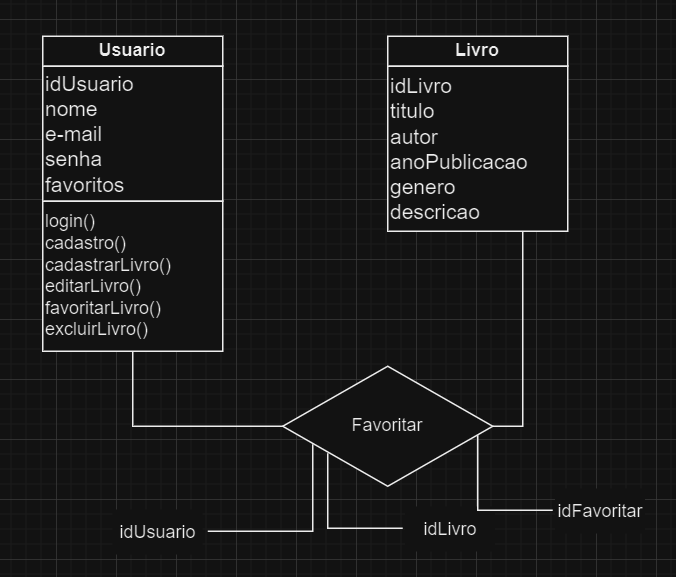
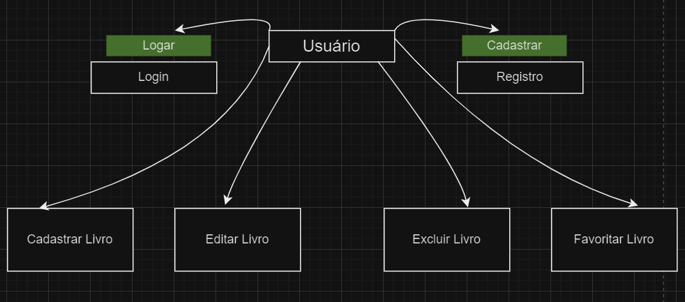
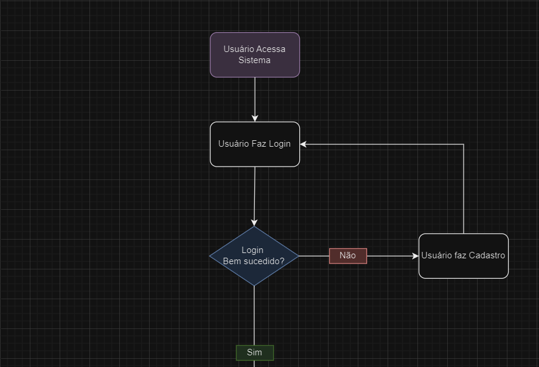
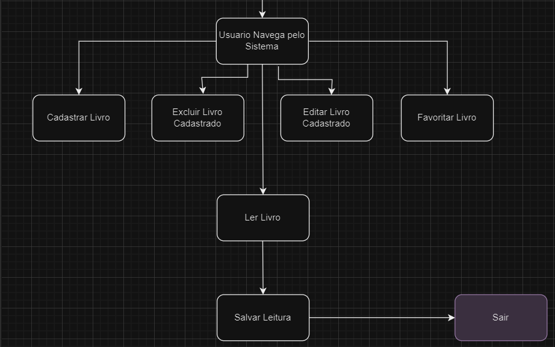

# LDCollection

### **Projeto:**

Sistema Web de Acervo Digital

### **Descrição do Projeto:**

LDCollection é uma empresa em que você pode realizar a leitura de livros, documentários, notícias, cadastrar novos livros e marcar seus favoritos, promovendo uma melhor organização e acesso ao acervo de leitura digital.

- **Escopo:**
    
    Este sistema de acervo digital é uma aplicação web que permitirá que os usuários leiam livros diretamente na plataforma, façam o cadastro de novos livros e organizem sua coleção pessoal de favoritos. A aplicação proporcionará uma interface interativa, para busca e visualização de livros disponíveis no acervo, permitindo uma navegação eficiente e uma experiência de leitura personalizada.
    
    

**Objetivos SMART**

- **Específico**:
    
    Desenvolver uma aplicação web de acervo digital com funcionalidades básicas de CRUD (Create, Read, Update, Delete) para livros, leitura online, favoritação de livros, e gerenciamento de perfis de usuários.
    
- **Mensurável:**
    - Tela de login e registro de usuários.
    - Tela principal com a lista de livros disponíveis.
    - Funcionalidades para adicionar, editar, remover e favoritar livros.
    - Sistema de leitura online com interface amigável.
    - Persistência de dados utilizando banco de dados relacional.
    - Implementação de uma interface amigável e responsiva com React.
- **Atingível:**
O projeto será desenvolvido utilizando frameworks e ferramentas amplamente utilizados e documentados, como React para o frontend, Node.js e Next.js para o backend. Utilizando bibliotecas e frameworks estabelecidos, como JWT para autenticação.
- **Relevante**:
A aplicação ajudará leitores e administradores a gerenciar e acessar um acervo digital de maneira eficiente e segura, proporcionando uma experiência de leitura digital personalizada.
- **Temporal:**
    
    **Projeto será concluído em 8 semanas, seguindo este cronograma:**
    
    - Planejamento e definição de requisitos: 1 semana
    - Desenvolvimento do backend (Laravel): 2 semanas
    - Desenvolvimento do frontend (React): 3 semanas
    - Integração e testes: 1 semana
    - Documentação e entrega: 1 semana

    

### **Planejamento do Projeto:**

- **Cronograma:**

| Etapa | Descrição | Tempo Estimado |
| --- | --- | --- |
| Planejamento e definição de requisitos | Levantamento de requisitos, escopo, diagramas, objetivos e recursos | 1 semana |
| Desenvolvimento do backend | Configuração do ambiente, criação de models e controllers, implementação de funcionalidades backend (Laravel) | 2 semanas |
| Desenvolvimento do frontend | Implementação da interface do usuário e funcionalidades frontend (React) | 3 semanas |
| Integração e testes | Integração entre frontend e backend, testes funcionais, correção de bugs | 1 semana |
| Documentação e entrega | Revisão final, documentação técnica e de usuário, preparação para entrega | 1 semana |

- **Recursos:**
    - **Equipe de Desenvolvimento:**
        - Desenvolvedor Frontend: Especializado em React e design responsivo.
        - Desenvolvedor Backend: Especializado em Node.js
        - UX/UI Designer: Responsável pela experiência do usuário e design da interface.
    - **Ferramentas de Desenvolvimento:**
        - IDE: Visual Studio Code com extensões para Laravel e React.
        - Gerenciamento de Projeto: Jira para tarefas e sprints.
        - Prototipagem: Figma para design de interface e prototipagem.
    - **Tecnologias:**
        - Frontend: React.js com hooks e context API.
        - Backend:Node.js e Next.js para a integração com o front.
        - Banco de Dados: MongoDB para armazenamento de dados não relacional.
        - Autenticação: JWT (JSON Web Tokens).
        - Sistema de Controle de Versão: Git com GitHub para colaboração e versionamento.

### **Análise de Riscos:**

**Risco 1:** Atrasos no desenvolvimento devido a mudanças nos requisitos ou problemas técnicos.

**Solução:** Planejamento detalhado e flexível, comunicação constante com a equipe e gerenciamento ágil. Desenvolvimento de Sprints ao longo da semana.

**Risco 2:** Dificuldades na integração entre o frontend e o backend.

**Solução:** Estabelecer padrões de API claros desde o início, realizar testes de integração regularmente e manter documentação atualizada da API.

**Risco 3:** Problemas na aplicação de tecnologias.

**Solução:** Realize treinamentos focados nas tecnologias que serão utilizadas, cursos específicos.

### **Diagramas**

**Diagrama de Classe:**

**Diagrama de Classe:**

**Diagrama de Fluxo:**

